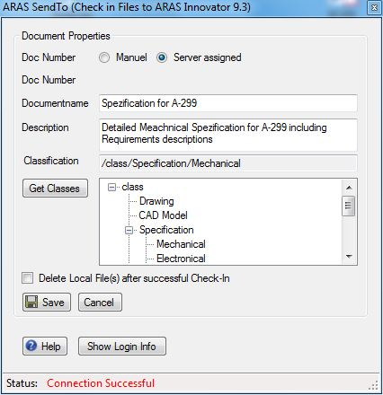

# Aras SendTo

Lets user check-in Files to Innovator directly from the Windows Explorer Context menu "Send To".

Simply select one or many files in Windows Explorer and right click "Send to Aras Innovator".

## History

This project and the following release notes have been migrated from the old Aras Projects page.

Release | Notes
--------|--------
[v9.3](https://github.com/ArasLabs/aras-send-to/releases/tag/v9.3) | Visual Studio Project (VB Source Code) for Aras Innovator 9.3. New MSI Install to Support Aras Innovator Version 9.3. Please remove old version before you install this version.
[v9.1](https://github.com/ArasLabs/aras-send-to/releases/tag/v9.1) | Visual Studio Project (VB Source Code) for Aras Innovator 9.1. One line of code added to fix a small problem around document classes. Works still with older Aras Innovator Version. New MSI Install to support Aras Innovator Version 9.1+. Installing this version will remove the old version of "Aras Send To" from your system. The Installation will still copy only one file to your "Send To" folder on your system.
[v8.1](https://github.com/ArasLabs/aras-send-to/releases/tag/v8.1) | Quick Start, MSI Installer for Aras Send to, and Visual Studio Project (VB Source Code).

#### Supported Aras Versions

Project | Aras
--------|------
[v9.3](https://github.com/ArasLabs/aras-send-to/releases/tag/v9.3) | 9.3, 11.0 SP9, 11.0 SP11
[v9.1](https://github.com/ArasLabs/aras-send-to/releases/tag/v9.1) | 8.1, 9.1
[v8.1](https://github.com/ArasLabs/aras-send-to/releases/tag/v8.1) | 8.1

## Installation

Download the MSI Installer and run the .msi. This will install just one single file in your SendTo Folder, nothing else.

Open Windows Explorer, right click on a file and click on SendTo - Aras Innovator. You dont need to download the Visual Studio Project if you dont want to make modifications in the code.

## Usage

## Contributing

1. Fork it!
2. Create your feature branch: `git checkout -b my-new-feature`
3. Commit your changes: `git commit -am 'Add some feature'`
4. Push to the branch: `git push origin my-new-feature`
5. Submit a pull request

For more information on contributing to this project, another Aras Labs project, or any Aras Community project, shoot us an email at araslabs@aras.com.

## Credits

Created by Martin Allemann.

Contributors:
* @AngelaIp

## License

Aras Labs projects are published to Github under the MIT license. See the [LICENSE file](./LICENSE.md) for license rights and limitations.
